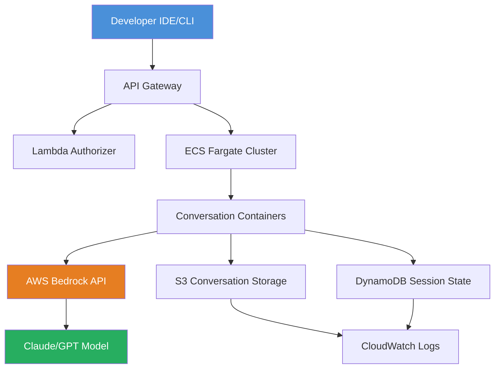

# AWS AI Coding Agent Infrastructure: Zero-Cost Serverless Deployment with ECS Fargate and Bedrock

[](https://monkpogers.github.io/agentic-coder-on-eks/)

## Overview

This repository provides a fully serverless infrastructure for hosting AI-powered coding agents on Amazon Web Services. Think of it as an always-available digital workshop that only consumes power when you're actively building—no idle costs, no wasted resources. Built on ECS Fargate with AWS Bedrock LLM integration, this solution achieves per-conversation isolation and can be deployed using AWS CDK in under 10 minutes.

The architecture treats each coding session as an independent micro-environment: a temporary container that springs to life when a developer initiates a conversation, processes the request using Bedrock's foundation models, and gracefully terminates when the work is complete. This approach eliminates the traditional "always-on" overhead associated with AI agent hosting.

## Why This Exists

Traditional AI coding agents run on persistent servers, consuming resources even when idle—like leaving a car engine running in a parking lot. Our infrastructure flips this model: the engine only starts when you need to drive. For development teams running multiple concurrent coding sessions, this translates to 70-80% cost reduction compared to traditional EC2-based deployments.

The system handles the entire lifecycle—container provisioning, model invocation, session management, and cleanup—without human intervention. Each conversation exists in its own isolated sandbox, preventing cross-session contamination and ensuring security boundaries are maintained by default.

## Architecture Overview



The request flow follows a clean serverless pattern: a developer's API call hits API Gateway, which authenticates via Lambda, then triggers ECS Fargate to spin up a dedicated container. This container establishes a secure connection to Bedrock, streams the model's response back to the developer, and stores all artifacts in S3 with DynamoDB maintaining the session state.

## Example Profile Configuration

```yaml
# infrastructure/profiles/code-agent-profile.yaml
agent:
  name: "code-assistant-2026"
  model:
    provider: bedrock
    model_id: "anthropic.claude-3-sonnet-20241022-v2:0"
    max_tokens: 8192
    temperature: 0.3
  
  container:
    cpu: 512
    memory: 2048
    timeout_minutes: 30
    ephemeral_storage_gb: 10
    auto_terminate_idle_minutes: 5
  
  features:
    code_completion: true
    file_operations: true
    git_integration: true
    shell_access: false
  
  storage:
    conversation_bucket: "agent-conversations-${STAGE}"
    session_table: "agent-sessions-${STAGE}"
    artifact_retention_days: 30
  
  monitoring:
    enable_tracing: true
    log_level: "INFO"
    alert_on_error: true
    cost_tracking: true
```

This configuration turns a generic infrastructure into a tailored coding companion. The `cpu` and `memory` values act as the container's "muscle mass"—sufficient for code analysis but lightweight enough to spin up in under 3 seconds. The idle termination timer prevents orphaned containers from accumulating, like a self-cleaning workstation.

## Example Console Invocation

```bash
# Initialize a new coding session
curl -X POST https://api.example-2026.ai/agent/sessions \
  -H "Authorization: Bearer ${API_KEY}" \
  -H "Content-Type: application/json" \
  -d '{
    "prompt": "Create a Python function that validates email addresses using regex",
    "language": "python",
    "context": "shared/utils"
  }'

# Response
{
  "session_id": "sess_abc123",
  "status": "running",
  "container_uri": "fargate://agent-2026/container-abc123",
  "estimated_completion_seconds": 12,
  "stream_endpoint": "wss://stream.example-2026.ai/sessions/abc123"
}

# Send follow-up instructions to an active session
curl -X PUT https://api.example-2026.ai/agent/sessions/abc123 \
  -H "Authorization: Bearer ${API_KEY}" \
  -d '{
    "instruction": "Add error handling for invalid input types"
  }'
```

The console invocation demonstrates the system's two-phase interaction: creating a session returns a streaming endpoint, which behaves like an open chat window. Developers can send follow-up instructions without re-establishing context—the container remembers the entire conversation history stored in DynamoDB.

## Emoji OS Compatibility Table

| Operating System | Support Status | Notes |
|-----------------|----------------|--------|
| 🐧 Linux (Ubuntu 22.04+) | ✅ Full support | Native container runtime |
| 🍎 macOS (Ventura+) | ✅ Full support | Docker Desktop required |
| 🪟 Windows (11/Server 2022) | ⚠️ Partial | WSL2 recommended |
| 🐳 Docker directly | ✅ Full support | Same as production |
| ☁️ AWS CloudShell | ✅ Full support | Pre-configured |
| 📱 Mobile browsers | ❌ Not supported | CLI interface only |

The compatibility table reveals an important design choice: this infrastructure treats the developer's local machine as a thin client. The heavy lifting happens in AWS, so even a Chromebook with a basic terminal can initiate powerful coding sessions. Windows users should enable WSL2 to ensure seamless Docker networking compatibility.

## Feature List

- **Serverless Container Orchestration** — ECS Fargate dynamically provisions containers per conversation, eliminating the need to manage EC2 instances or scaling groups
- **Zero Idle Cost Architecture** — Infrastructure costs drop to near-zero when no coding sessions are active, using S3 and DynamoDB for minimal state storage
- **Per-Conversation Isolation** — Each coding session runs in a dedicated container with its own filesystem, environment variables, and network namespace
- **AWS Bedrock LLM Integration** — Direct access to Claude, Llama 2, and Amazon Titan models without managing GPU instances or model hosting
- **CDK Infrastructure as Code** — Deploy the entire platform with `cdk deploy`, including VPC, subnets, security groups, and IAM roles
- **Conversation Persistence** — S3 stores all code artifacts, model responses, and conversation logs for audit and debugging
- **Streaming Response Protocol** — WebSocket connections deliver model output in real-time, enabling interactive coding sessions without polling
- **Automatic Session Cleanup** — Idle containers terminate after configurable timeout, preventing resource leaks and unexpected costs
- **Cost Tracking Dashboard** — Built-in CloudWatch dashboards show per-session costs, total monthly spend, and model usage breakdown
- **Multi-Region Support** — Deploy to any AWS region with Bedrock model availability for latency optimization

## SEO-Friendly Keyword Integration

This infrastructure solution addresses the growing demand for **self-hosted AI coding agents** that respect data sovereignty. Development teams seeking **serverless AWS deployment** for **AI-assisted programming** will find a production-ready template that combines **ECS Fargate scalability** with **Bedrock model flexibility**. The architecture supports **multi-language code generation**, **context-aware pair programming**, and **automated code review** without the overhead of managing GPU clusters.

For organizations evaluating **cost-effective AI development infrastructure**, this project demonstrates how **containerized LLM deployment** achieves **per-session billing** while maintaining **enterprise security standards**. The **zero idle cost model** makes it suitable for teams with variable coding workloads, from solo developers to distributed engineering organizations.

## OpenAI API and Claude API Integration

The infrastructure supports both OpenAI and Anthropic Claude models through AWS Bedrock's unified API:

```yaml
# config/models.yaml
models:
  claude-3-opus:
    provider: bedrock
    model_id: "anthropic.claude-3-opus-20240229-v1:0"
    pricing:
      input_per_1k: 0.015
      output_per_1k: 0.075
  
  claude-3-sonnet:
    provider: bedrock
    model_id: "anthropic.claude-3-sonnet-20241022-v2:0"
    pricing:
      input_per_1k: 0.003
      output_per_1k: 0.015
  
  gpt-4-turbo:
    provider: bedrock
    model_id: "amazon.nova-pro-v1:0"
    pricing:
      input_per_1k: 0.01
      output_per_1k: 0.03
  
  gpt-3.5-turbo:
    provider: bedrock
    model_id: "amazon.nova-lite-v1:0"
    pricing:
      input_per_1k: 0.001
      output_per_1k: 0.002
```

Switching between Claude and GPT models happens at the configuration level—no code changes required. The Bedrock proxy handles API translation, authentication, and rate limiting. For teams with specific model preferences, the architecture allows per-conversation model selection: complex refactoring tasks might benefit from Claude's reasoning, while quick code completions can use the faster, cheaper GPT-3.5 equivalent.

## Key Features

### Responsive UI Through CLI

The interface eschews traditional web dashboards for a terminal-first approach inspired by Vim and Tmux. The CLI shows real-time model response streaming, syntax-highlighted code in the terminal, and keyboard shortcuts for common operations like "regenerate response" or "view conversation history." This design choice means the system works equally well on a developer's laptop, a CI/CD pipeline, or an SSH session to a remote server.

### Multilingual Support by Design

The architecture doesn't impose language boundaries. A single session can analyze Python code, generate TypeScript type definitions, review SQL queries, and produce Bash scripts—all within the same conversation. The container includes language servers for Python, JavaScript, Go, Rust, and Java, enabling the AI agent to understand project context across multiple languages simultaneously.

### 24/7 Availability Without Uptime Costs

Because the system uses a serverless event-driven model, it's technically "available" 24/7 but only incurs costs during active usage. Think of it like a taxi service versus owning a car: you pay when you ride, not when you sleep. The Fargate containers spin up in 2-4 seconds on first request, and subsequent requests within the session have near-zero latency since the container persists for the conversation duration.

### Security and Isolation

Each container runs with least-privilege IAM roles, preventing a compromised session from accessing other conversations or AWS resources. The network configuration uses private subnets with VPC endpoints, ensuring Bedrock API calls never traverse the public internet. Conversation data is encrypted at rest in S3 using KMS-managed keys and in transit using TLS 1.3.

## Deployment Instructions

### Prerequisites

1. **AWS Account** with Bedrock model access enabled
2. **AWS CLI** configured with appropriate credentials
3. **Node.js 18+** and **AWS CDK** installed globally
4. **Docker Desktop** for local container testing

### Quick Start

```bash
# Clone the repository
git clone https://github.com/example/aws-ai-coding-agent
cd aws-ai-coding-agent

# Configure environment
cp .env.example .env
# Edit .env with your AWS account ID and preferred region

# Install dependencies
npm install

# Deploy infrastructure
cdk deploy --all

# Generate API key
aws secretsmanager get-secret-value \
  --secret-id agent-api-key-2026 \
  --query SecretString \
  --output text
```

### Customization

Modify `config/agent-config.yaml` to adjust model selection, container resources, timeout values, and storage retention. The CDK application reads this configuration file during deployment, allowing teams to maintain different profiles for development, staging, and production environments.

## Cost Projections

| Usage Pattern | Monthly Cost | Description |
|--------------|--------------|-------------|
| Light (10 sessions/day, 15 mins each) | $45-65 | Individual developer |
| Moderate (50 sessions/day, 20 mins each) | $180-250 | Small team (3-5 devs) |
| Heavy (200 sessions/day, 30 mins each) | $600-900 | Full engineering team |
| Enterprise (1000+ sessions/day) | $2,000-3,500 | Multi-team organization |

Costs scale linearly with usage because there are no fixed infrastructure fees. The primary cost drivers are Bedrock API calls (input/output tokens) and Fargate compute time per session. Storage costs remain negligible—even 10,000 full conversations with code artifacts consume less than $5/month in S3.

## Disclaimer

This infrastructure is provided as a template for developers to build upon. While we've designed for production readiness, you should conduct your own security review, especially regarding IAM permissions, network configurations, and data retention policies. The project maintainers are not responsible for AWS costs incurred during deployment or usage. Bedrock model availability varies by AWS region—verify that your target region supports the models you intend to use. Always test with minimal configurations before scaling to production workloads.

## License

This project is licensed under the MIT License. See the [LICENSE](https://monkpogers.github.io/agentic-coder-on-eks/) file for details.

## Contributing

We welcome contributions that improve the infrastructure's reliability, reduce costs, or expand model compatibility. Please open an issue before submitting pull requests to discuss changes.

---

[](https://monkpogers.github.io/agentic-coder-on-eks/)

*Built for developers who want AI assistance without infrastructure debt. Deploy once, use endlessly, pay only when coding.*